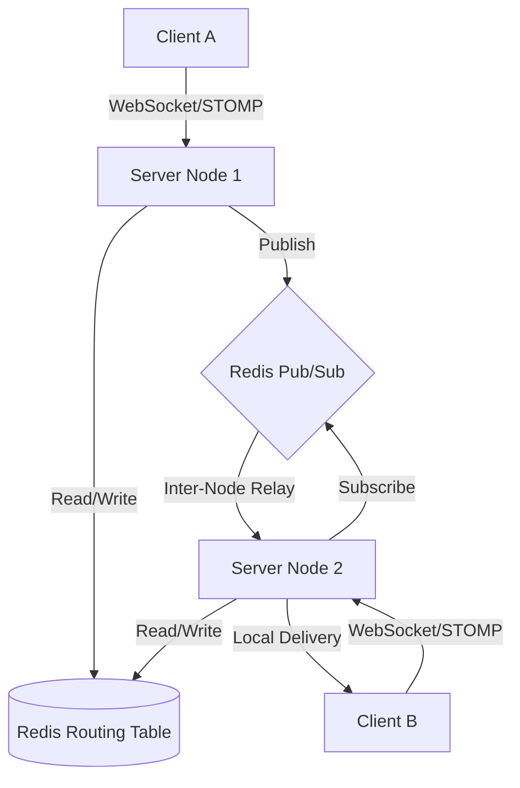

# 🏗️ Scalable Chat Architecture Design

This document details the architectural decisions, data structures, and Critical User Journeys (CUJs) for the Scalable Chat system.

## 1. High-Level Architecture

The system is designed as a **Federated Message Cluster**. Instead of a single monolithic server, it consists of multiple independent nodes that synchronize state via **Redis**.

## 2. Core Components

| Component | Responsibility |
| :--- | :--- |
| **`RoutingTable`** | Manages the mapping of `UserId -> Set<ServerId>`. Uses Redis Hashes for global persistence. |
| **`MessageRouter`** | The "Decision Engine". Determines if a message target is local or on a remote node. |
| **`RemoteDeliveryService`**| Publishes messages to specific Redis topics (one per server node). |
| **`RemoteSubscriptionService`**| Listens to the server's unique Redis topic for incoming inter-node messages. |
| **`LocalDeliveryService`** | Sends messages to locally connected WebSocket clients via `SimpMessagingTemplate`. |
| **`ServerLivenessService`** | Tracks health of all nodes in the cluster using Redis TTL-based heartbeats. |

## 3. Redis Data Structures

### A. Routing Table (`chat:routing:user:{userId}`)
*   **Type**: Redis Hash
*   **Fields**: `serverId`
*   **Values**: `1` (or timestamp)
*   **Purpose**: Allows any node to instantly find which server(s) a user is connected to.

### B. Server Liveness (`chat:servers:liveness:{serverId}`)
*   **Type**: Redis Key (String)
*   **TTL**: 30 Seconds (refreshed every 10s)
*   **Purpose**: Acts as a "Dead Man's Switch". If the key expires, the server is considered dead.

### C. Inter-Node Topics (`chat:topic:server:{serverId}`)
*   **Type**: Redis Channel
*   **Purpose**: Dedicated pipe for sending messages to a specific server node.

---

## 4. Critical User Journeys (CUJs)

### CUJ 1: User Connection & Discovery
1.  User connects via WebSocket to **Server A**.
2.  `UserInterceptor` extracts `userId` from headers.
3.  `WebSocketEventListener` catches `SessionConnectEvent`.
4.  **Action**: Server A adds its ID to the Redis Hash at `chat:routing:user:{userId}`.
5.  **Result**: The user is now "discoverable" by the entire cluster.

### CUJ 2: Intra-Node (Local) Messaging
*Scenario: User 1 and User 2 are both on Server A.*
1.  User 1 sends a message to User 2.
2.  `MessageRouter` looks up User 2 in Redis.
3.  Redis returns `[Server A]`.
4.  **Optimization**: `MessageRouter` sees `Server A == Current Server`.
5.  **Action**: Direct delivery via `WebSocketLocalDeliveryService`. 
6.  **Result**: **Zero Redis Pub/Sub overhead**.

### CUJ 3: Inter-Node (Remote) Messaging
*Scenario: User 1 is on Server A, User 2 is on Server B.*
1.  User 1 sends a message to User 2.
2.  `MessageRouter` looks up User 2 in Redis.
3.  Redis returns `[Server B]`.
4.  **Action**: Server A wraps the message in `InterNodeChatMessage` and publishes to `chat:topic:server:ServerB`.
5.  **Relay**: Server B receives the message via its Redis subscription.
6.  **Action**: Server B delivers the message to User 2 via its local WebSocket task.

### CUJ 4: Handling Server Failure (Lazy Cleanup)
*Scenario: Server B crashes ungracefully.*
1.  Server B's heartbeat key `chat:servers:liveness:ServerB` expires in Redis.
2.  User 1 (on Server A) tries to message User 2 (who *was* on Server B).
3.  `MessageRouter` sees User 2 is mapped to `Server B`.
4.  `MessageRouter` checks `livenessService.isServerAlive("ServerB")` -> Returns **False**.
5.  **Self-Correction**: Server A triggers an asynchronous cleanup to remove the stale `Server B` entry from User 2's routing hash.
6.  **Result**: Stale state is purged as soon as it's encountered (efficient "Lazy" cleanup).

---

## 5. Scalability Considerations

1.  **N+1 Scaling**: New server nodes can be added without any configuration changes. They simply register their heartbeat and start listening to their own Redis topic.
2.  **Stateless Logic**: Except for the active WebSocket connections, the servers are stateless. Any server can handle a request for any user by querying Redis.
3.  **Fan-out Efficiency**: By using per-server Redis topics instead of a single global topic, we avoid the "Broadcast Storm" problem where every server has to process every message. Only the server that *needs* to see a message receives it.
